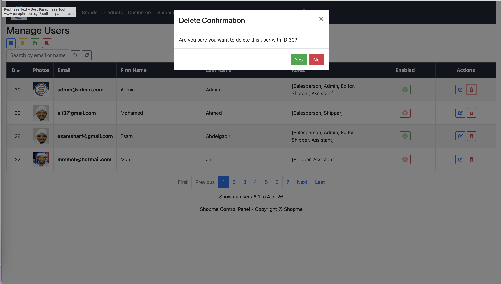

# Shopme Ecommerce

Shopme is a simple ecommerce website built with Spring Boot and bootstrap. It is a simple project to learn Spring Boot and bootstrap.

## Features

- User registration
- User login
- User profile
- Product listing
- Product detail
- Add to cart
- Checkout
- Order history
- Admin dashboard
- Admin product management
- Admin user management
- Admin order management
- Admin category management
- Admin setting management
- Admin report generation
- Admin shipping management
- Admin payment management
- Admin coupon management
- Admin review management
- Admin product rating management
- Admin product review management
- Admin product question management

## Technologies

- Spring Boot
- Spring Security
- Spring Data JPA
- Spring MVC
- Spring Mail
- Spring Web
- Spring DevTools
- Spring Boot Starter Test
- Spring Boot Starter Thymeleaf
- Spring Boot Starter Validation
- Spring Boot Starter Web
- Spring Boot Starter Data JPA
- Spring Boot Starter Security
- Spring Boot Starter Mail

- Bootstrap
- jQuery
- Thymeleaf
- JPA
- Hibernate
- MySQL
- Maven

## Requirements

- Java 8
- Maven 3
- MySQL 5.7

## Installation

- Clone the repository
- Create a MySQL database named shopme
- Change MySQL username and password as per your MySQL installation
- Open terminal and run the following command to run the project -

- Below are the commands to run, build, clean and package the project etc.
```bash
mvn spring-boot:run # Run the project
mvn clean # Clean the project
mvn clean package -DskipTests # Clean and package the project
mvn package # Package the project
mvn install # Install the project
mvn test # Test the project
mvn compile # Compile the project
mvn spring-boot:run # Run the project
mvn spring-boot:build-image # Build the project
mvn spring-boot:help # Help for the project
mvn spring-boot:stop # Stop the project
mvn spring-boot:start # Start the project
```

- Open your favorite browser and go to http://localhost:8080

## Screenshots





## License

This project is licensed under the MIT License - see the [LICENSE](LICENSE) file for details

## Contact

If you want to contact me you can reach me at [Gmail](mailto:asimsharf@gmail.com).

## Donate

If you found this project useful, you can buy me a cup of coffee :)

[](https://www.paypal.me/asimsharf)

## Contributing

Pull requests are welcome. For major changes, please open an issue first to discuss what you would like to change.

Please make sure to update tests as appropriate.

## Acknowledgments

- [Spring Boot](https://spring.io/projects/spring-boot)
- [Bootstrap](https://getbootstrap.com/)
- [jQuery](https://jquery.com/)
- [Thymeleaf](https://www.thymeleaf.org/)
- [JPA](https://www.oracle.com/java/technologies/persistence-jsp.html)
- [Hibernate](https://hibernate.org/)
- [MySQL](https://www.mysql.com/)
- [Maven](https://maven.apache.org/)
- [Font Awesome](https://fontawesome.com/)
- [Google Fonts](https://fonts.google.com/)

## Author

- [Asim Sharf](sudagoarth.com)

## Udemy Course Link

- [Spring Boot and Bootstrap Ecommerce Project](https://www.udemy.com/share/1043TE3@8gublmsQkmlYrf8M9Ds2cqmd8U_n-6dqAvBs4RpCdQA78RMycMd8B6sIybpABhHwcA==/)
